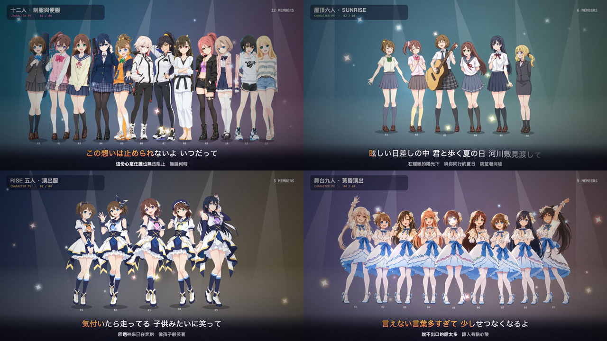

# NewEffects

首頁是 BEST 4U 歌詞 PV（`index.html`）；第二版本 `v2.html` 是動態歌詞播放器：在 YouTube 影片或本機 MP3 上疊加動態歌詞特效，並提供六位參考人物與 Q 版偶像的「載歌載舞」舞台。

## 啟動

```bash
./serve.sh
```

macOS 也可雙擊 `啟動播放器.command`，會在終端機啟動伺服器並開啟頁面。兩種方式都會使用 http://127.0.0.1:8765，按 Ctrl+C 停止這次啟動的伺服器。

可用 `./serve.sh 8766` 指定其他埠號（1–65535）。若同一埠號已有播放器，會直接開啟；若被其他程式占用，會提示改用其他埠號。指令檔可從任意工作目錄執行，檔案路徑也可包含空格。需要 Python 3 與 curl；YouTube 嵌入需要透過網址開啟，不能直接雙擊 HTML。

## 功能

- 歌詞特效：卡拉OK填色、逐字彈跳、霓虹燈、逐字浮現、柔焦夢幻
- 中日雙語字幕：SRT 每段第二行放繁中翻譯，會顯示在日文特效行下方並隨時間填色；下一句預覽同步顯示中日文
- 和聲（`［］`、`《》`、`[]` 內文字）以小字淺藍色顯示；`漢字(かな)` 顯示為注音假名
- 載歌載舞：六位人物會抬手、側擺、踏步及跳躍；可切換參考人物／Q 版、選擇主唱並調整舞動強度
- MP3 以低頻偵測節拍，中頻音量驅動主唱嘴型與音符；嘴型為音量開合效果。YouTube 因無法取得音訊，使用固定 120 BPM
- 桌面舞台和控制列適應視窗高度，側欄獨立捲動；手機直向排列。長歌詞自動縮放至最多兩行，避免被舞台裁切
- 打點對時：貼上歌詞後按「開始打點」，每句開始時按 Space，可匯出 LRC
- 支援匯入 LRC／SRT，歌曲清單可新增 YouTube 網址；歌詞面板的「匯出雙語 SRT」可輸出目前時間軸的中日雙語字幕

## 歌詞 PV

首頁 `index.html` 是每首歌的歌詞 PV（1920×1080），用同一套 `pv.js` 在瀏覽器即時預覽，或輸出成 MP4；原本的動態歌詞播放器改為第二版本 `v2.html`，兩頁互相有連結：

- 預覽：開啟 `http://127.0.0.1:8765/?song=0`（0 大好きだよって叫ぶんだ、1 SUNRISE、2 HELLO HERO、3 風の中は走るっきゃないっ！）
- 輸出：`node render-pv.mjs`（`pv.js` 裡的全部歌曲同時輸出到 `pv/`），或 `node render-pv.mjs 1 --from 60 --to 72` 只輸出片段。需要 Google Chrome 與 ffmpeg

人物由使用者提供的參考圖去背切出來：把參考圖放進 `assets/ref/`（`rise5.webp` 五人演出服白底、`lineup12.webp` 十二人色條底、`rooftop6.webp`、`stage9.webp`），執行 `node tools/cutout.mjs` 產生 `assets/ref/cast/` 的角色 PNG 與 `cast.json`。每首歌的主視覺與成員在 `pv.js` 的 `ARTS`、`SONGS[].cast` 設定（第一位是主唱）：大好きだよって叫ぶんだ 用 RISE 演出服，SUNRISE 用制服，HELLO HERO 用智的隊伍，風の中は走るっきゃないっ！ 用生徒会六人（`assets/ref/cast/anaru-*.png`，主視覺 `assets/ref/anaru6.png`）。角色以切圖分條彎曲、跳躍、壓縮做出跟拍舞動。

## 四組造型人物動畫 PV



- 開啟 `http://127.0.0.1:8770/index.html?mode=characters` 或從首頁按「人物 PV」。也可使用 `serve.sh` 的 8765 埠。
- 完整歌曲、1920×1080、30 fps；十二人制服與便服、屋頂六人、RISE 五人演出服、黃昏九人舞台服每 15 秒輪替，持續到配樂結束，並隨整首歌曲驅動節拍、側擺、微跳、聚光與轉場。
- `cast.html` 可檢查與下載全部 32 張透明 PNG，四組分別為 `casual`（12）、`rooftop`（6）、`idol`（5）、`stage`（9）。這是四組造型切圖數量，包含重複人物。
- 屋頂與黃昏原圖背景先使用內建 imagegen 分離，透明圖層保存在 `assets/ref/*-matte.png`；切圖工具保留 alpha 並依連通區塊分配人物。去背提示記錄於 [assets/ref/CUTOUTS.md](assets/ref/CUTOUTS.md)。原圖中互相遮擋的部分未補畫；黃昏段落用完整透明群像側彎，保留相連裙襬的接縫。
- 輸出：`node render-pv.mjs --mode characters --out pv/characters/full`；預設輸出三首完整歌曲 MP4，含音樂淡入淡出。可指定一首歌曲編號，例如 `node render-pv.mjs 1 --mode characters`；需要短片段時使用 `--from` / `--to`。
- macOS 可加 `--encoder h264_videotoolbox` 使用硬體 H.264 編碼（16 Mbps）；預設仍使用 `libx264`。
- 每支壓縮至 100 MB 以下：`node tools/compress-pv.mjs`。輸出至 `pv/characters/under100mb/`，保留全曲、原解析度與幀率；使用兩遍 H.264 編碼、128 kbps AAC 音訊，並驗證實際大小及完整解碼。MB 以 1,000,000 bytes 計算，預留 5% 空間。可用 `--in 資料夾 --out 資料夾 --max-mb 100` 自訂。
- 播放進度支援跳轉；切換配樂保留人物模式。MP4 依既有規則留在本機，程式與切圖提交 Git。

鏡頭依歌詞與音訊自動編排：片頭立體貼紙字標題、膠卷逐字歌詞（左日文右中文）、成員視窗＋搜尋列歌詞、大字逐字蹦出、副歌舞台（LED 螢幕、聚光燈、彩帶）、尾聲拍立得。節拍由 MP3 偵測，舞步、轉場與 HUD（時間碼、小節、段落）都跟著節拍走。BEST 4U 封面在 `assets/best4u-cover.webp`。輸出的 MP4 在 `pv/`，不進 repo。

## 歌曲檔案

MP3 與字幕檔（SRT／LRC）有版權，不放在這個 repo（見 `.gitignore`）。
把檔案放在與 `index.html` 同一個資料夾，並在 `v2.html` 的 `DEFAULT_SONGS`（播放器）與 `pv.js` 的 `SONGS`（PV）設定檔名：

```js
{id: 'YouTube 影片 ID', title: '歌名', audio: '歌曲.mp3', subs: '字幕.srt', lead: 0}
```

`lead` 是前排主唱（0–5）：小日向理瀬、葉山陽和、前原純華、小鷹咲希、橘雪乃、御社智。介面的主唱選單可以覆寫每首歌的設定。

字幕檔為中日雙語 SRT：每段第一行日文、第二行繁中翻譯（不含假名的那一行會被當成翻譯）。純日文 SRT 也能照常使用。

```
1
00:00:10,772 --> 00:00:21,339
手をとっては競い合って　少しずつ僕ら進んでゆく
牽起手來彼此較勁　我們一步步向前邁進
```

## 人物素材

播放器的「參考人物」和 PV 共用 `assets/ref/cast/` 的去背切圖（由 `node tools/cutout.mjs` 從 `assets/ref/` 的參考圖產生）。`dance-sprites.js` 依主唱選單順序載入小日向理瀬、葉山陽和、前原純華、小鷹咲希、橘雪乃、御社智六人，以分條側彎、跳躍與壓縮做出舞動；素材無法載入時自動改用 Canvas Q 版舞者。
